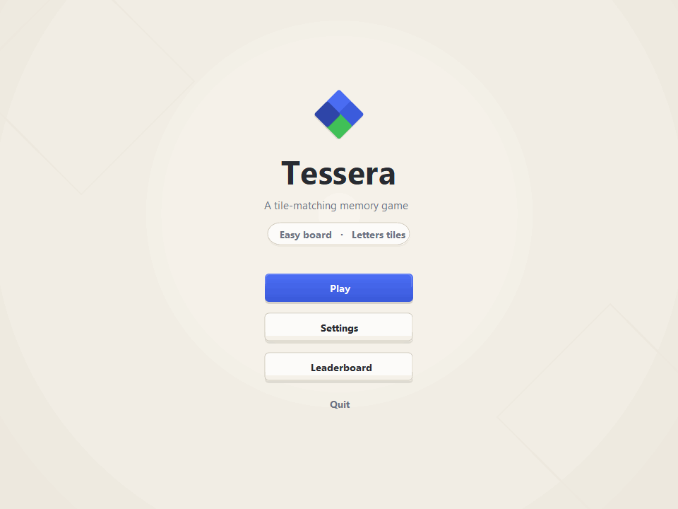
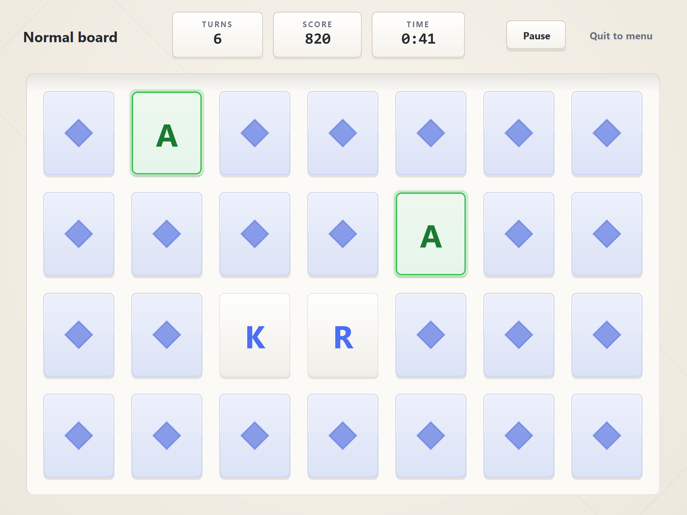
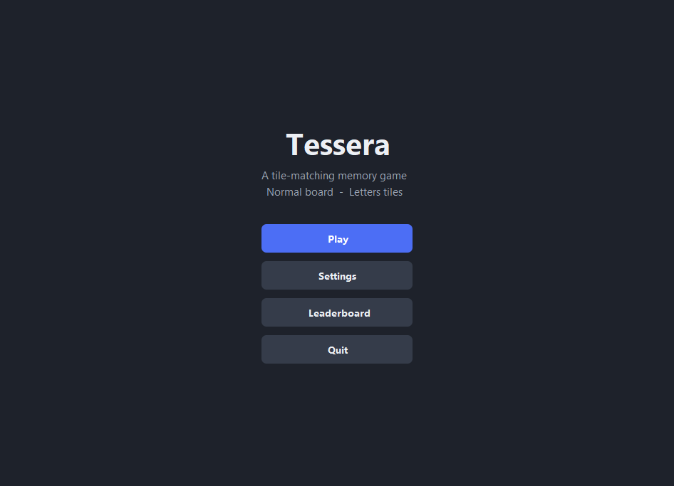

# Tessera

[](https://github.com/yib7/Tessera/actions/workflows/ci.yml)

A tile-matching memory game for the desktop, written in Java with Swing.

Pick a board size, memorize the tiles, and clear the board in as few turns and
as little time as you can. Scores are ranked per board size and saved between
sessions.







## What it does

- Three board sizes: Easy (3x4), Normal (4x7), Hard (7x8).
- Three tile themes: letters, numbers, and geometric symbols. Faces are drawn
  in code, so the game bundles no image files.
- A memorize phase before each round: the whole board opens face up with a
  countdown that scales with board size, then flips down to start play, so a
  run rewards recall rather than blind luck.
- A scoring system that goes beyond raw turn count. Score rewards matched pairs,
  penalizes mismatched flips, and adds a speed bonus that decays over time, so a
  fast clean game beats a slow lucky one.
- A live HUD showing turns, score, and elapsed time.
- Pause and resume that stops the clock and hides the board behind a cover, so
  pausing mid-turn cannot be used to study a revealed tile.
- Full keyboard play: arrow keys move focus across the tile grid, Enter or
  Space flips the focused tile, and Escape toggles pause.
- Tactile tile animations on a Swing timer: an ease-in-out flip with a
  brightness veil, a green glow when a pair matches, and a red flash and shake
  when a pair misses, so a wrong guess is never in doubt.
- Optional sound cues, synthesized at runtime (no audio files bundled).
- A persistent leaderboard keeping the top five runs per board size. The file
  format tolerates a missing or corrupt file and ignores malformed lines instead
  of crashing.
- Settings (board size, theme, sound) that persist to disk.

## Tech stack

- Java 21
- Swing and AWT (custom-painted components, no external look-and-feel library)
- No third-party runtime dependencies

## Supported platform

Tested on Windows 11 with a Java 21 runtime. The code uses only the Java
standard library and no OS-specific calls, so it should run on macOS and Linux
with a Java 21 runtime, though those have not been verified for this release.

## Play it

You need a Java 21 (or newer) runtime to run the packaged game.

1. Download or build `dist/Tessera.jar` (build steps below).
2. Double-click the jar, or run it from a terminal:

   ```
   java -jar dist/Tessera.jar
   ```

That is the whole launch. The game opens on the main menu.

The leaderboard and settings are written to a `.tessera` folder in your home
directory, so the jar can live anywhere.

## Build it

You need a JDK 21 (or newer) with `javac` and `jar` on your `PATH`.

On Windows:

```
build.cmd
```

On macOS or Linux:

```
./build.sh
```

Either script compiles `src/` into `bin/` and packages `dist/Tessera.jar` with a
`Main-Class` manifest entry. `run.cmd` / `run.sh` build the jar if needed, then
launch it.

If your JDK is installed but not on `PATH`, invoke the tools by full path, for
example:

```
/path/to/jdk-21/bin/javac -d bin $(find src -name "*.java")
/path/to/jdk-21/bin/jar --create --file dist/Tessera.jar --main-class tessera.Tessera -C bin .
```

## Run the tests

The logic tests are a self-contained runner with no test framework to install.

On Windows:

```
test.cmd
```

On macOS or Linux:

```
./test.sh
```

Or directly:

```
javac -d bin-test $(find src test -name "*.java")
java -cp bin-test tessera.LogicTests
```

They cover board dealing, match detection, scoring, the leaderboard round trip
and corrupt-file handling, and a full controller playthrough. The runner exits
non-zero on any failure.

## How it is built

See [docs/ARCHITECTURE.md](docs/ARCHITECTURE.md) for the model-view-controller
layout, the turn state machine, and how the board, scoring, and persistence fit
together.

## License

MIT. See [LICENSE](LICENSE).
