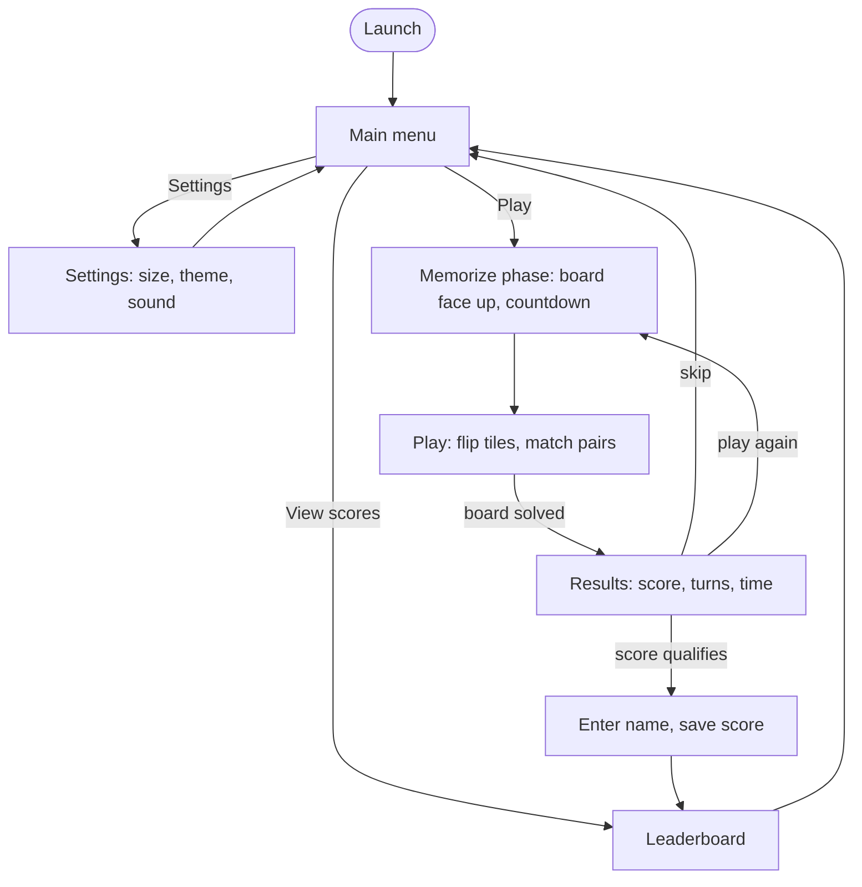
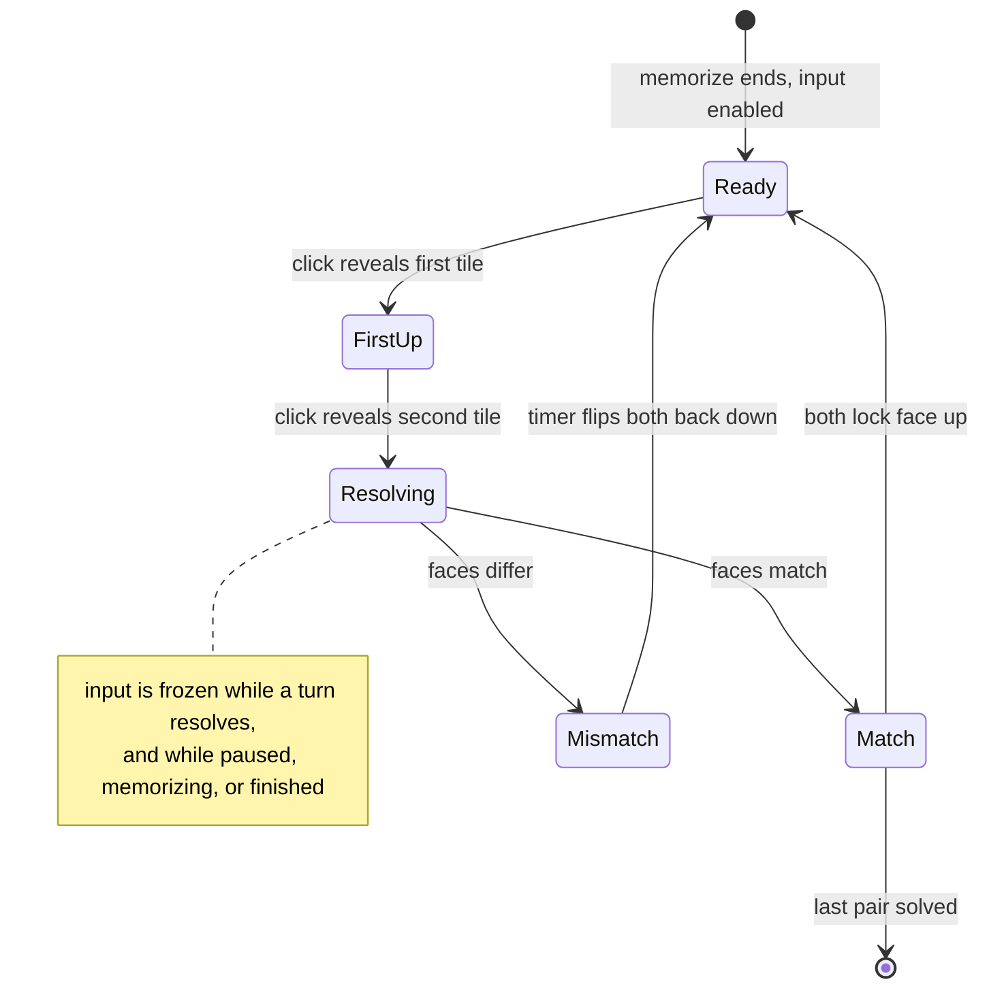

# Architecture

Tessera is a Swing desktop game organized as model-view-controller. The goal of
this document is to let a newcomer find their way around in a few minutes.

## Package layout

```
src/tessera/
  Tessera.java              entry point: loads state, sets the theme, shows the window
  model/                    game state and rules, no Swing imports
  view/                     Swing screens and the custom-painted tile
  controller/               turn logic and screen navigation
test/tessera/
  LogicTests.java           headless checks for the model and controller
```

The model package has no dependency on `javax.swing` or `java.awt` except for
colors packed as plain ints in `TileTheme`. That keeps the game rules testable
without a display, which is what `LogicTests` relies on.

## Screen flow

Every screen is a card in one `MainWindow`; `Navigator` swaps between them. A run
moves through the memorize phase into play, and a qualifying score routes through
name entry to the leaderboard before returning to the menu.



## Model

- `BoardSize` is an enum of named geometries (Easy, Normal, Hard). Each one
  validates that its cell count is even so the board can always form complete
  pairs.
- `TileTheme` is an enum of named face palettes. Each theme supplies at least
  enough distinct faces for the largest board (28 pairs) plus an accent color.
  Faces are strings, so a theme can mix letters, multi-digit numbers, and
  symbols.
- `Tile` is one card. It holds its face value and two flags: face up and
  matched.
- `Board` owns the deal. It takes one face per pair from the theme, duplicates
  each face, shuffles the whole stack with `Collections.shuffle`, and lays it
  out row by row. Passing a seeded `Random` makes the deal deterministic for
  tests. This replaces the original coordinate-shuffling deal, which could place
  a face an uneven number of times and looped on edge cases.
- `GameSession` is the mutable state of one playthrough: the board, the running
  tallies (turns, matches, mismatches), and a clock that only advances while the
  game is running and not paused. It is the single source of truth the HUD,
  pause, and scoring all read from.
- `ScoreCalculator` turns a finished session into one comparable number. The
  score is a per-pair reward scaled by board size, minus a per-mismatch penalty,
  plus a speed bonus that decays after a short grace period. The result is
  clamped at zero.
- `ScoreEntry` is one persisted high score as a record, with tab-delimited
  serialization and a forgiving parser that returns null on a malformed line.
- `Leaderboard` keeps the top five entries per board size, ranked by score with
  turns then time as tie-breakers. It tolerates a missing file (starts empty)
  and skips malformed lines instead of failing.
- `Settings` holds board size, theme, and the sound toggle, persisted as a
  properties file. Reads fall back to defaults on any problem.
- `DataPaths` resolves the writable data directory under the user's home
  (`~/.tessera`). The original game wrote to a relative `./Resources/` path that
  broke when launched from a packaged jar.

## View

- `Theme` is the single source of colors and fonts. It picks a system sans-serif
  if one is installed and falls back to the JVM's logical `SansSerif`, so the UI
  never silently substitutes a missing font.
- `TileButton` is a `JComponent` painted by hand. It renders the tile's states
  (face down, hover, keyboard focus, face up, matched, and mismatch), each as a
  gradient fill with a painted edge, and animates the change between face down and
  face up as a time-based flip: scale width to zero, swap which side shows at the
  midpoint, scale back out, with a brightness veil that peaks edge-on. A matched
  pair pulses a green glow and a mismatched pair shakes with a red flash, all on
  one Swing `Timer`, so every motion stays on the event dispatch thread. The
  component holds only presentation state; the logical card state lives in the
  model.
- `GamePanel` builds the tile grid, wires each tile's click to the controller,
  and shows the live HUD with pause and quit. It implements the controller's
  `GameView` interface, so the controller drives the animations without knowing
  the view is Swing. It also runs the pre-game memorize phase: on entry it opens
  every tile face up, counts down for a few seconds in place of the HUD stats,
  then flips the board face down and enables input. The clock is left alone, so
  the memorize time never counts against the score.
- `MenuPanel`, `SettingsPanel`, `ResultsPanel`, and `LeaderboardPanel` are the
  other screens.
- `MainWindow` is the one application window. It hosts every screen in a
  `CardLayout` and implements the `Navigator` interface. This replaces the old
  flow, which created a new `JFrame` for each screen and disposed the previous
  one.
- `UiFactory` builds the shared styled controls (the gradient-painted button set,
  labels, and chips) so the panels read as layout rather than per-widget styling.
  The larger de-stocked controls (the segmented picker, dropdown, toggle, text
  field, and styled leaderboard table) live in their own classes alongside it.
- `SoundPlayer` synthesizes short sine-tone cues at runtime on a daemon thread.
  Any audio-system failure is swallowed, since cues are not essential to play.

## Controller

- `Navigator` defines the screens and the methods panels call to move between
  them. Panels never reach for sibling panels or frames; they call back through
  this interface, which keeps the navigation graph in `MainWindow`.
- `GameView` is what the controller needs the board view to do (flip a tile,
  mark a match or a mismatch, toggle input, update the HUD, signal a win).
  Implementing it as an interface keeps the controller free of Swing painting code.
- `GameController` runs one game. It is the only place that mutates the session
  in response to clicks.

### Turn state machine



A turn is two flips:

1. First click reveals a tile and records it as the pending first tile.
2. Second click reveals a tile, then resolves the turn in the flip callback:
   - On a match, both tiles lock face up, the session records a match, and the
     board is checked for a win.
   - On a mismatch, the session records a mismatch, input is frozen, and a short
     `Timer` flips both tiles back down before input is restored.

Input is ignored while a turn is resolving, while paused, during the pre-game
memorize phase, or once the game is finished, so a fast clicker cannot reveal a
third tile mid-turn. The controller asks the view to animate but never blocks on
the animation; the view calls back when each flip settles. The memorize phase is
a controller flag (`beginPreview` / `endPreview`) that refuses input; the view
owns the countdown and the reveal so the rule still lives in the controller.

## Startup flow

`Tessera.main` runs on the event dispatch thread. It applies the system
look-and-feel as a base, layers `Theme`'s UIManager defaults on top, loads
settings and the leaderboard, and shows `MainWindow` on the menu screen. From
there `Navigator` drives every screen change.

## Persistence

Two files under `~/.tessera`:

- `settings.properties`: board size, tile theme, sound toggle.
- `leaderboard.tsv`: top scores, one tab-delimited line per entry, grouped by
  board size, with a comment header.

Both are written best-effort. A failed settings write is ignored so it never
blocks play. `Leaderboard.save` still raises an unchecked exception on a write
failure, but the results screen catches it, so a disk error never breaks the
save-score flow: the entry is already on the in-memory board and still shows for
the session, it just is not persisted.

## Testing

`LogicTests` is a plain `main` that runs a sequence of assertions and exits
non-zero on the first failure. It is not a JUnit suite, because the project
ships no third-party jars and a single self-contained runner keeps the build to
one `javac` call. It exercises the deal, match detection, scoring, the
leaderboard round trip and corrupt-file handling, and a full controller
playthrough using a synchronous test double for `GameView`.
